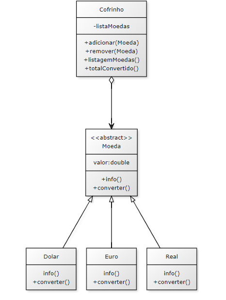

# Projeto "Cofrinho de Moedas" em Java

## Proposta

Projeto desenvolvido como parte da disciplina de Programação Orientada a Objetos do curso de Engenharia de Computação da UNINTER têm como propósito a implementação de um sistema que simula um "Cofrinho de Moedas" em Java. O sistema é composto por um menu interativo que oferece diversas opções ao usuário:

1. **Adicionar moedas:** Permite ao usuário incluir moedas de diferentes valores e países no cofrinho.
2. **Remover moedas:** Possibilita a remoção de moedas específicas do cofrinho.
3. **Listar moedas:** Exibe uma lista de todas as moedas presentes no cofrinho.
4. **Calcular valor total:** Calcula o valor total do dinheiro no cofrinho, convertendo-o para a moeda local (Real).

O principal enfoque deste projeto é avaliar a aplicação eficaz dos conceitos de herança e polimorfismo. A execução do trabalho requer a implementação de classes conforme detalhadas no diagrama UML fornecido abaixo:

## Diagrama

## Ferramentas Utilizadas

**Ambiente de Desenvolvimento Integrado (IDE):**

- **Eclipse**

Utilizei o Eclipse como nossa principal IDE para o desenvolvimento do projeto. Você pode baixar o Eclipse em https://www.eclipse.org/downloads/

**Kit de Desenvolvimento Java:**

- **JDK 17** 

Adotei o JDK 17 como nosso Kit de Desenvolvimento Java para garantir compatibilidade e utilizar as mais recentes funcionalidades da linguagem. O JDK 17 está disponível para download em https://www.oracle.com/br/java/technologies/downloads/#java17